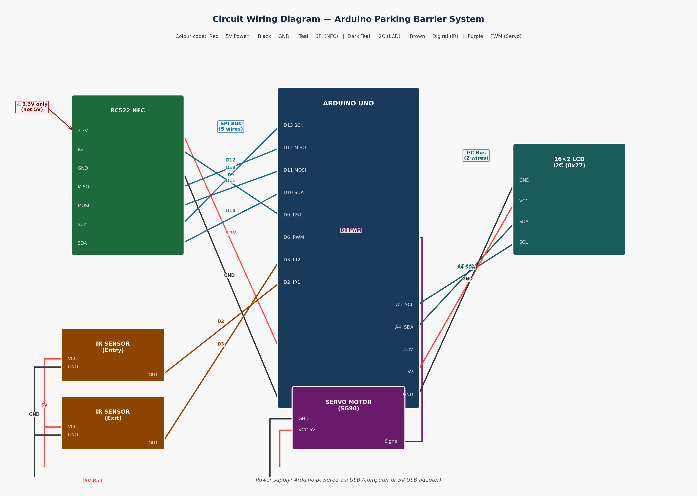
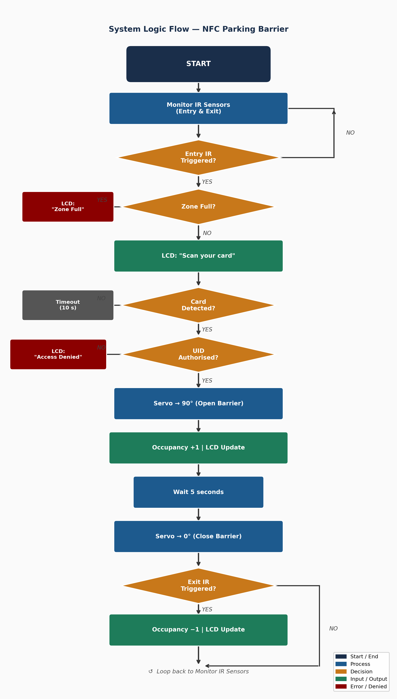

# Arduino NFC Parking Barrier

A low-cost smart parking barrier built on the Arduino Uno platform. The system uses NFC card authentication to control a servo-operated barrier arm, tracks vehicle occupancy using two IR proximity sensors, and displays zone status on a 16x2 LCD.

Built as a BSc Applied Computing final year project at the University of Wales Trinity Saint David, 2024-2025.

---

## Hardware

| Component | Quantity | Approx. Cost |
|---|---|---|
| Arduino Uno R3 | 1 | £18 |
| RC522 NFC Module | 1 | £4 |
| IR Proximity Sensor | 2 | £3 |
| Servo Motor (SG90) | 1 | £4 |
| 16x2 LCD + I2C Module | 1 | £5 |
| Small Adhesive Breadboard | 1 | £3 |
| Jumper Wires (M-M / M-F) | 1 pack | £3 |
| **Total** | | **~£40** |

---

## Wiring



| Component | Arduino Pin | Notes |
|---|---|---|
| RC522 SDA (CS) | Digital 10 | |
| RC522 SCK | Digital 13 | |
| RC522 MOSI | Digital 11 | |
| RC522 MISO | Digital 12 | |
| RC522 RST | Digital 9 | |
| RC522 Power | 3.3V | Not 5V — will damage the module |
| Entry IR Sensor OUT | Digital 2 | |
| Exit IR Sensor OUT | Digital 3 | |
| Servo Signal | Digital 6 | |
| LCD SDA | Analogue A4 | |
| LCD SCL | Analogue A5 | |

---

## System Logic



---

## Setup

### Required Libraries

Install via the Arduino IDE Library Manager (Sketch > Include Library > Manage Libraries):

- `MFRC522` by GithubCommunity (v1.4.10 or later)
- `LiquidCrystal I2C` by Frank de Brabander (v1.1.2 or later)
- `Servo` — built in, no installation needed

### Uploading

1. Connect the Arduino Uno to your computer via USB
2. Open `main.ino` in the Arduino IDE
3. Select Tools > Board > Arduino Uno
4. Select the correct port under Tools > Port
5. Click Upload

---

## Registering NFC Cards

1. Upload the sketch and open the Serial Monitor at 9600 baud
2. Hold a card or phone to the RC522 reader
3. The UID will be printed, for example: `Card UID detected: A3F19201`
4. Add the UID string to the `authorisedUIDs[]` array in `main.ino`
5. Update `UID_COUNT` to match the number of entries
6. Re-upload

---

## Configuration

At the top of `main.ino`:

```cpp
const int MAX_CAPACITY            = 5;     // Maximum vehicles allowed in the zone
const int OPEN_ANGLE              = 90;    // Servo angle when barrier is open (degrees)
const int CLOSED_ANGLE            = 0;     // Servo angle when barrier is closed (degrees)
const unsigned long OPEN_DURATION = 5000;  // How long the barrier stays open (ms)
```

---

## LCD I2C Address

If the display shows garbled characters, the I2C address in the code may not match your module. Upload `i2c_scanner.ino`, open the Serial Monitor, and it will print the correct address. Then update this line in `main.ino`:

```cpp
LiquidCrystal_I2C lcd(0x27, 16, 2); // replace 0x27 with your address
```

Common addresses are `0x27` and `0x3F`.

---

## Prototype

<!-- Add prototype.jpg to this repository once the hardware is built -->

---

## Test Results

Evaluated through 30 controlled access simulations — 20 authorised and 10 unauthorised attempts.

| Group | Attempts | Pass | Fail | Success Rate |
|---|---|---|---|---|
| Authorised | 20 | 20 | 0 | 100% |
| Unauthorised | 10 | 9 | 1 | 90% |
| Overall | 30 | 29 | 1 | 97% |

Mean response time for authorised attempts: 1.8 seconds. Target was under 3 seconds.

The single failure was caused by a missing UID length validation in the authentication function. The fix is included in the current version of `main.ino`.

---

## Troubleshooting

See [TROUBLESHOOTING.md](TROUBLESHOOTING.md).

---

## Repository Structure

```
arduino-nfc-parking-barrier/
├── main.ino                Main Arduino sketch
├── i2c_scanner.ino         Utility to find the LCD I2C address
├── circuit.png             Wiring diagram
├── flowchart.png           System logic flow diagram
├── BOM.md                  Full bill of materials
├── TROUBLESHOOTING.md      Common problems and fixes
├── LICENSE                 MIT licence
└── README.md               This file
```

---

## Licence

MIT. See [LICENSE](LICENSE).

---

## Author

Fouad Bouabdi-Benaatou  
BSc Applied Computing, University of Wales Trinity Saint David  
Supervisor: Mr. Abrar Jahin Almazi Bipon  
Ethics Reference: ETH-2024-089
